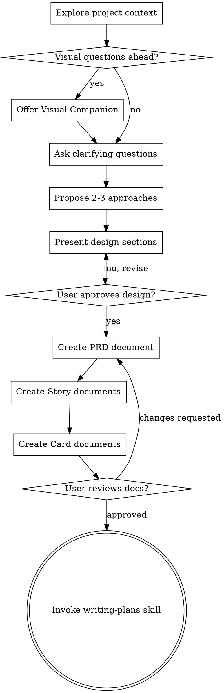

# Brainstorming Ideas Into Designs

Help turn ideas into fully formed designs through natural collaborative dialogue, then output as **PRD → Story → Card** 3-layer documents.

Start by understanding the current project context, then ask questions one at a time to refine the idea. Once you understand what you're building, present the design and get user approval.

<HARD-GATE>
Do NOT invoke any implementation skill, write any code, scaffold any project, or take any implementation action until you have presented a design and the user has approved it. This applies to EVERY project regardless of perceived simplicity.
</HARD-GATE>

## Integration with ai-workflow

**This skill outputs documents following the ai-workflow 3-layer system:**

```
┌─────────────────────────────────────────────────────────────┐
│                  Brainstorming Output                        │
├─────────────────────────────────────────────────────────────┤
│  Layer 1: PRD   → docs/prds/PRD-{FEATURE}.md                │
│  Layer 2: Story → docs/stories/US-{PRD-PREFIX}-{NNN}.md     │
│  Layer 3: Card  → docs/cards/CARD-{PRD-PREFIX}-{NNN}.md     │
└─────────────────────────────────────────────────────────────┘
```

**All documents follow ai-workflow templates:**
- PRD: `ai-workflow/references/prd-template.md`
- Story: `ai-workflow/references/story-template.md`
- Card: `ai-workflow/references/card-template-v2.md`

## Anti-Pattern: "This Is Too Simple To Need A Design"

Every project goes through this process. A todo list, a single-function utility, a config change — all of them. "Simple" projects are where unexamined assumptions cause the most wasted work. The design can be short (a few sentences for truly simple projects), but you MUST present it and get approval.

## Checklist

You MUST create a task for each of these items and complete them in order:

1. **Explore project context** — check files, docs, recent commits
2. **Offer visual companion** (if topic will involve visual questions) — this is its own message, not combined with a clarifying question. See the Visual Companion section below.
3. **Ask clarifying questions** — one at a time, understand purpose/constraints/success criteria
4. **Propose 2-3 approaches** — with trade-offs and your recommendation
5. **Present design** — in sections scaled to their complexity, get user approval after each section
6. **Write 3-layer documents** — create PRD, Stories, and Cards following ai-workflow templates
7. **Document review** — ask user to review before proceeding
8. **Transition to implementation** — invoke writing-plans skill to create implementation plan

## Process Flow



**The terminal state is invoking writing-plans.** Do NOT invoke frontend-design, mcp-builder, or any other implementation skill. The ONLY skill you invoke after brainstorming is writing-plans.

## The Process

**Understanding the idea:**

- Check out the current project state first (files, docs, recent commits)
- Before asking detailed questions, assess scope: if the request describes multiple independent subsystems (e.g., "build a platform with chat, file storage, billing, and analytics"), flag this immediately. Don't spend questions refining details of a project that needs to be decomposed first.
- If the project is too large for a single spec, help the user decompose into sub-projects: what are the independent pieces, how do they relate, what order should they be built? Then brainstorm the first sub-project through the normal design flow. Each sub-project gets its own spec → plan → implementation cycle.
- For appropriately-scoped projects, ask questions one at a time to refine the idea
- Prefer multiple choice questions when possible, but open-ended is fine too
- Only one question per message - if a topic needs more exploration, break it into multiple questions
- Focus on understanding: purpose, constraints, success criteria

**Exploring approaches:**

- Propose 2-3 different approaches with trade-offs
- Present options conversationally with your recommendation and reasoning
- Lead with your recommended option and explain why

**Presenting the design:**

- Once you believe you understand what you're building, present the design
- Scale each section to its complexity: a few sentences if straightforward, up to 200-300 words if nuanced
- Ask after each section whether it looks right so far
- Cover: architecture, components, data flow, error handling, testing
- Be ready to go back and clarify if something doesn't make sense

**Design for isolation and clarity:**

- Break the system into smaller units that each have one clear purpose, communicate through well-defined interfaces, and can be understood and tested independently
- For each unit, you should be able to answer: what does it do, how do you use it, and what does it depend on?
- Can someone understand what a unit does without reading its internals? Can you change the internals without breaking consumers? If not, the boundaries need work.
- Smaller, well-bounded units are also easier for you to work with - you reason better about code you can hold in context at once, and your edits are more reliable when files are focused. When a file grows large, that's often a signal that it's doing too much.

**Working in existing codebases:**

- Explore the current structure before proposing changes. Follow existing patterns.
- Where existing code has problems that affect the work (e.g., a file that's grown too large, unclear boundaries, tangled responsibilities), include targeted improvements as part of the design - the way a good developer improves code they're working in.
- Don't propose unrelated refactoring. Stay focused on what serves the current goal.

## After the Design

**Create 3-Layer Documents:**

### Step 1: Create PRD

Create `docs/prds/PRD-{FEATURE-NAME}.md` with YAML frontmatter:

```yaml
---
id: "PRD-FEATURE-NAME"             # PRD- prefix + UPPERCASE
title: "Feature Title"
description: "Brief description"
status: "draft"                    # draft | pending | in-progress | done | blocked | ready
pattern: discovery-driven          # collection-driven | discovery-driven | requirements-first
keyLearning: "Main insight from design"
project: ww                        # ww | rk | vec | foundation | *
stories: []                        # Will be filled after creating stories
cards: []                          # Will be filled after creating cards
verification:
  codeExists: false
  prdAccurate: unknown
  testsExist: false
  lastVerified: null
---
```

### Step 2: Create Stories

For each user capability identified in the design, create `docs/stories/US-{PRD-PREFIX}-{NNN}.md`:

```yaml
---
id: US-{PRD-PREFIX}-{NNN}
title: User can [action]
description: [Brief description]
parent_prd: PRD-{FEATURE-NAME}
cards: []                          # Will be filled after creating cards
status: backlog
acceptance_criteria:
  - [Criterion 1]
  - [Criterion 2]
---
```

**Story naming convention:**
- Use PRD prefix to group related stories
- Number sequentially within the PRD
- Example: `US-AUTH-001`, `US-AUTH-002` for `PRD-USER-AUTH`

### Step 3: Create Cards

For each technical task identified in the design, create `docs/cards/CARD-{PRD-PREFIX}-{NNN}.md`:

```yaml
---
id: CARD-{PRD-PREFIX}-{NNN}
title: Implement [specific task]
description: [Brief description]
parent_story: US-{PRD-PREFIX}-{NNN}
parent_prd: PRD-{FEATURE-NAME}
status: backlog
priority: high | medium | low
estimate: Xh
implementation_checklist:
  - [Task 1]
  - [Task 2]
files_to_modify:
  - path/to/file.ts
---
```

**Card naming convention:**
- Use PRD prefix to match parent story
- Number sequentially
- Example: `CARD-AUTH-001`, `CARD-AUTH-002` for `US-AUTH-001`

### Step 4: Update Links

After creating all documents, update the links:

1. **PRD** → Add story IDs to `stories: []` array
2. **PRD** → Add card IDs to `cards: []` array
3. **Stories** → Add card IDs to `cards: []` array

### Step 5: Commit

Commit all documents together:

```bash
git add docs/prds/PRD-*.md docs/stories/US-*.md docs/cards/CARD-*.md
git commit -m "docs: Add PRD-XXX with stories and cards from brainstorming

- PRD: Feature overview and architecture
- Stories: US-XXX-001 to US-XXX-NNN
- Cards: CARD-XXX-001 to CARD-XXX-NNN

Co-Authored-By: Claude <noreply@anthropic.com>"
```

## User Review Gate

After creating all documents, ask the user to review:

> "Documents created:
> - **PRD**: `docs/prds/PRD-XXX.md`
> - **Stories**: `docs/stories/US-XXX-*.md` (N files)
> - **Cards**: `docs/cards/CARD-XXX-*.md` (M files)
>
> Please review them and let me know if you want to make any changes before we start writing the implementation plan."

Wait for the user's response. If they request changes, make them. Only proceed once the user approves.

## Implementation

- Invoke the writing-plans skill to create a detailed implementation plan
- Do NOT invoke any other skill. writing-plans is the next step.

## Completeness Principle — Boil the Lake

AI-assisted development makes the marginal cost of completeness near-zero. When evaluating options:

- **Always recommend the complete implementation** over shortcuts when the delta is small. 80 lines vs 150 lines is meaningless with AI assistance.
- **Lake vs. ocean:** A "lake" is boilable — full feature implementation, 100% coverage for a module, all edge cases handled. An "ocean" is not — full system rewrites, multi-quarter migrations. Recommend boiling lakes; flag oceans as out of scope.
- **Show both effort scales** when estimating work:

| Task type | Human team | With AI | Compression |
|-----------|-----------|---------|-------------|
| Boilerplate / scaffolding | 2 days | 15 min | ~100x |
| Test writing | 1 day | 15 min | ~50x |
| Feature implementation | 1 week | 30 min | ~30x |
| Bug fix + regression test | 4 hours | 15 min | ~20x |
| Architecture / design | 2 days | 4 hours | ~5x |
| Research / exploration | 1 day | 3 hours | ~3x |

**Anti-patterns:**
- BAD: "Choose B — it covers 90% of the value." (If A costs 70 more lines, choose A.)
- BAD: "Defer test coverage to a follow-up PR." (Tests are the cheapest lake to boil.)
- BAD: Quoting only human effort: "This takes 2 weeks." (Say: "2 weeks human / ~1 hour with AI.")

## Key Principles

- **One question at a time** - Don't overwhelm with multiple questions
- **Multiple choice preferred** - Easier to answer than open-ended when possible
- **YAGNI ruthlessly** - Remove unnecessary features from all designs
- **Explore alternatives** - Always propose 2-3 approaches before settling
- **Incremental validation** - Present design, get approval before moving on
- **Be flexible** - Go back and clarify when something doesn't make sense
- **3-layer output** - Always create PRD → Story → Card documents

## Visual Companion

A browser-based companion for showing mockups, diagrams, and visual options during brainstorming. Available as a tool — not a mode. Accepting the companion means it's available for questions that benefit from visual treatment; it does NOT mean every question goes through the browser.

**Offering the companion:** When you anticipate that upcoming questions will involve visual content (mockups, layouts, diagrams), offer it once for consent:
> "Some of what we're working on might be easier to explain if I can show it to you in a web browser. I can put together mockups, diagrams, comparisons, and other visuals as we go. This feature is still new and can be token-intensive. Want to try it? (Requires opening a local URL)"

**This offer MUST be its own message.** Do not combine it with clarifying questions, context summaries, or any other content. The message should contain ONLY the offer above and nothing else. Wait for the user's response before continuing. If they decline, proceed with text-only brainstorming.

**Per-question decision:** Even after the user accepts, decide FOR EACH QUESTION whether to use the browser or the terminal. The test: **would the user understand this better by seeing it than reading it?**

- **Use the browser** for content that IS visual — mockups, wireframes, layout comparisons, architecture diagrams, side-by-side visual designs
- **Use the terminal** for content that is text — requirements questions, conceptual choices, tradeoff lists, A/B/C/D text options, scope decisions

A question about a UI topic is not automatically a visual question. "What does personality mean in this context?" is a conceptual question — use the terminal. "Which wizard layout works better?" is a visual question — use the browser.

If they agree to the companion, read the detailed guide before proceeding:
`skills/brainstorming/visual-companion.md`
