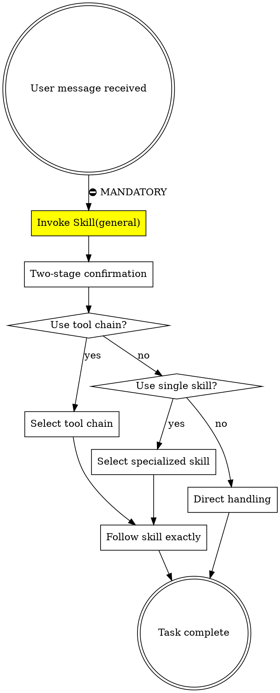

<SUBAGENT-STOP>
If you were dispatched as a subagent to execute a specific task, skip this skill.
</SUBAGENT-STOP>

<EXTREMELY-IMPORTANT>
If you think there is even a 1% chance a skill might apply to what you are doing, you ABSOLUTELY MUST invoke the skill.

IF A SKILL APPLIES TO YOUR TASK, YOU DO NOT HAVE A CHOICE. YOU MUST USE IT.

This is not negotiable. This is not optional. You cannot rationalize your way out of this.
</EXTREMELY-IMPORTANT>

## Instruction Priority

Superpowers skills override default system prompt behavior, but **user instructions always take precedence**:

1. **User's explicit instructions** (CLAUDE.md, GEMINI.md, AGENTS.md, direct requests) — highest priority
2. **Superpowers skills** — override default system behavior where they conflict
3. **Default system prompt** — lowest priority

If CLAUDE.md, GEMINI.md, or AGENTS.md says "don't use TDD" and a skill says "always use TDD," follow the user's instructions. The user is in control.

## How to Access Skills

**In Claude Code:** Use the `Skill` tool. When you invoke a skill, its content is loaded and presented to you—follow it directly. Never use the Read tool on skill files.

**In Gemini CLI:** Skills activate via the `activate_skill` tool. Gemini loads skill metadata at session start and activates the full content on demand.

**In other environments:** Check your platform's documentation for how skills are loaded.

# Using Skills (With Confirmation)

## ⛔ THE GOLDEN RULE - GENERAL IS THE ONLY ENTRY POINT

```
┌─────────────────────────────────────────────────────────────────────┐
│  ⛔ MANDATORY: ALL requests MUST go through general skill FIRST      │
├─────────────────────────────────────────────────────────────────────┤
│                                                                     │
│   User Request                                                      │
│       ↓                                                             │
│   Skill(general)  ← ☝️ THIS IS THE ONLY ALLOWED FIRST SKILL         │
│       ↓                                                             │
│   Two-stage confirmation (工具链 → 单独 skill → 直接处理)            │
│       ↓                                                             │
│   Specialized skill (brainstorming, debugging, etc.)               │
│                                                                     │
├─────────────────────────────────────────────────────────────────────┤
│  ❌ FORBIDDEN: Directly calling specialized skills as first skill   │
│  ❌ FORBIDDEN: Responding without calling general first             │
└─────────────────────────────────────────────────────────────────────┘
```

**Why?** The `general` skill implements the two-stage confirmation workflow that ensures consistent task handling.

## The Rule

**ALWAYS call Skill(general) FIRST.** The general skill will guide you through two-stage confirmation to select the appropriate tool chain or specialized skill.

## NEW: Skill Confirmation Flow

**Before invoking any skill, you MUST confirm with the user:**

```
┌─────────────────────────────────────────────────────────────┐
│  1. 分析用户请求，识别可能适用的 skills                        │
│  2. 使用 AskUserQuestion 让用户确认或纠正                      │
│  3. 用户确认后，使用 Skill 工具调用选定的 skill                 │
└─────────────────────────────────────────────────────────────┘
```

### 确认格式

使用 `AskUserQuestion` 工具，格式如下：

```json
{
  "questions": [{
    "question": "我检测到这个任务可能需要使用 skill，请确认或选择：",
    "header": "Skill 确认",
    "options": [
      {"label": "[推荐的 skill 名称]", "description": "[为什么推荐这个 skill]"},
      {"label": "[备选 skill 名称]", "description": "[备选原因]"},
      {"label": "general", "description": "不需要特殊 skill，使用通用处理"},
      {"label": "跳过确认", "description": "以后类似任务不再确认，直接执行"}
    ],
    "multiSelect": false
  }]
}
```

### 何时需要确认

| 场景 | 是否确认 |
|------|---------|
| 用户明确指定 skill | ❌ 直接执行 |
| 多个 skill 可能适用 | ✅ 让用户选择 |
| 不确定 skill 是否适用 | ✅ 让用户确认 |
| 简单问题（如"今天日期"） | ❌ 不需要 skill |
| 用户说"跳过确认" | ❌ 以后不再确认 |

### 确认示例

**用户输入**: "帮我修复这个 bug"

**Claude 行为**:
1. 识别候选 skills: `debugging`, `bug-fix-to-ship`
2. 调用 AskUserQuestion:

```json
{
  "questions": [{
    "question": "检测到 bug 修复任务，请选择处理方式：",
    "header": "Skill 确认",
    "options": [
      {"label": "bug-fix-to-ship (推荐)", "description": "完整修复流程：debugging → tdd → verification → code-review → finishing"},
      {"label": "debugging", "description": "仅分析根因，不自动修复"},
      {"label": "general", "description": "不使用特殊 skill，直接处理"}
    ]
  }]
}
```

3. 用户选择后，调用对应 skill

## Skill Flow Diagram



## Red Flags - You're Breaking The Rule

| Thought | Reality |
|---------|---------|
| "I'll just call brainstorming directly" | ❌ FORBIDDEN. Must call general first. |
| "This is clearly a bug fix, I'll call debugging" | ❌ FORBIDDEN. Must call general first. |
| "User explicitly asked for a specific skill" | ✅ OK to proceed directly (user decision) |
| "I already know which skill to use" | ❌ Still must call general for confirmation flow |

## Red Flags

These thoughts mean STOP—you're rationalizing:

| Thought | Reality |
|---------|---------|
| "This is just a simple question" | Questions are tasks. Check for skills. |
| "I need more context first" | Skill check comes BEFORE clarifying questions. |
| "Let me explore the codebase first" | Skills tell you HOW to explore. Check first. |
| "I can check git/files quickly" | Files lack conversation context. Check for skills. |
| "Let me gather information first" | Skills tell you HOW to gather information. |
| "This doesn't need a formal skill" | If a skill exists, use it. |
| "I remember this skill" | Skills evolve. Read current version. |
| "This doesn't count as a task" | Action = task. Check for skills. |
| "The skill is overkill" | Simple things become complex. Use it. |
| "I'll just do this one thing first" | Check BEFORE doing anything. |
| "This feels productive" | Undisciplined action wastes time. Skills prevent this. |
| "I know what that means" | Knowing the concept ≠ using the skill. Invoke it. |

## Skill Priority

When multiple skills could apply, use this order:

1. **Process skills first** (brainstorming, debugging) - these determine HOW to approach the task
2. **Implementation skills second** (frontend-design, mcp-builder) - these guide execution

"Let's build X" → brainstorming first, then implementation skills.
"Fix this bug" → debugging first, then domain-specific skills.

## Skill Types

**Rigid** (TDD, debugging): Follow exactly. Don't adapt away discipline.

**Flexible** (patterns): Adapt principles to context.

The skill itself tells you which.

## User Instructions

Instructions say WHAT, not HOW. "Add X" or "Fix Y" doesn't mean skip workflows.
